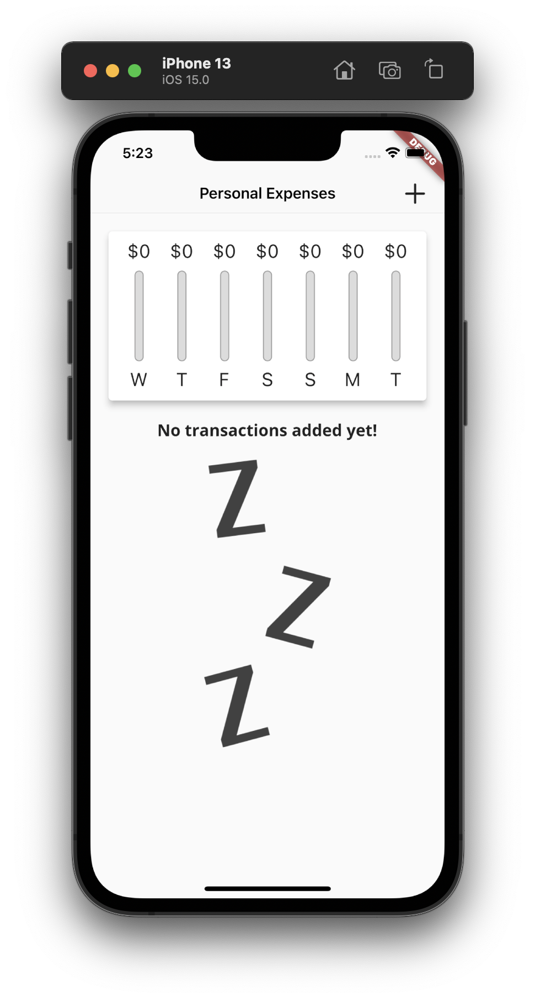
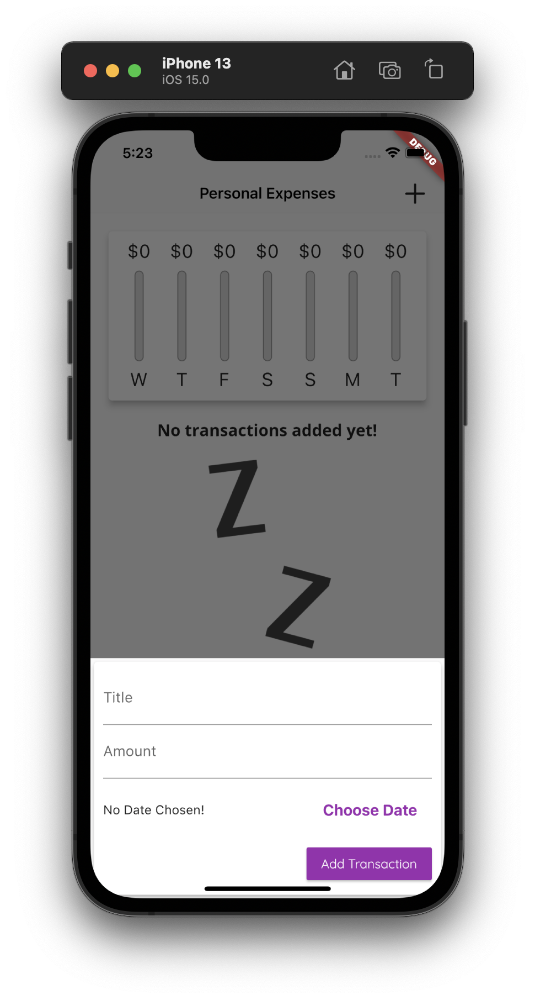
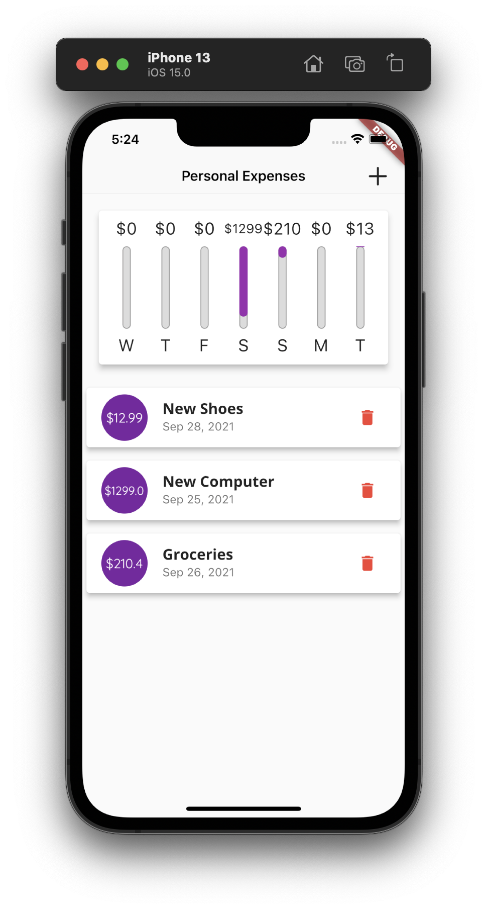
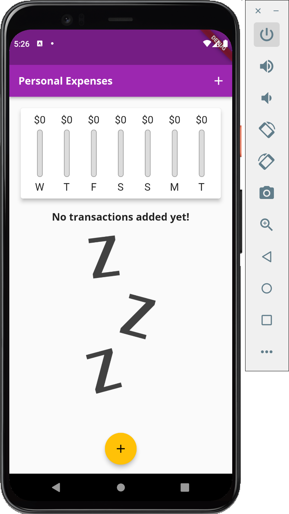
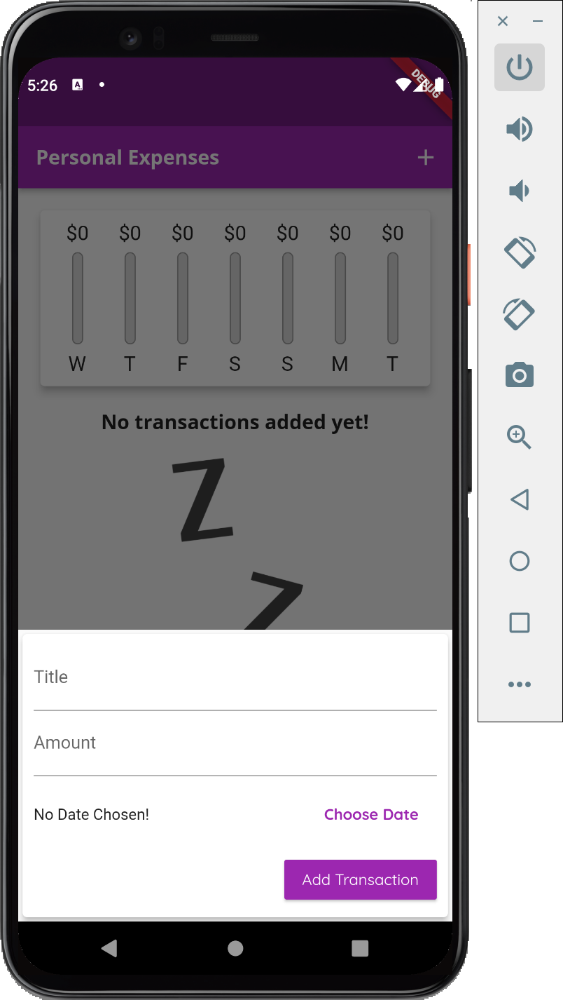
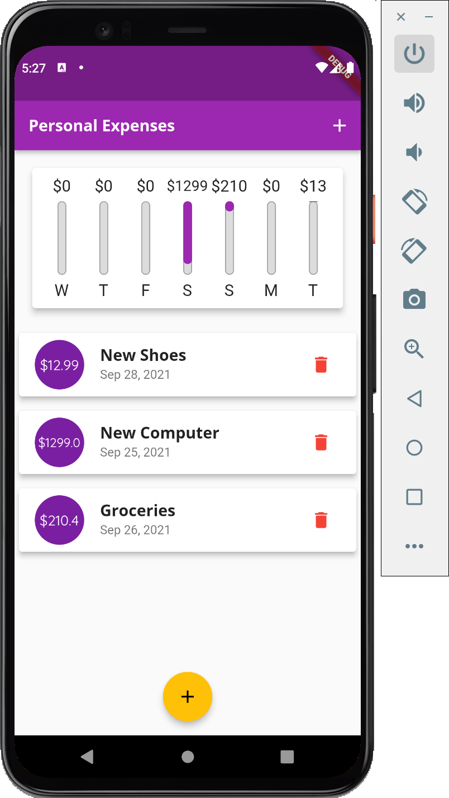

# flutter_complete_guide

A new Flutter project.

## Getting Started

This project is a practice of making a expense app.

## Function

1. Add transaction with title, amount, and date
2. Chart which displays the distribution of spending in a week
3. Ability to delete a transaction
4. Different look in different devices

## iOS Display Overview
### Initial Look

### Add Transaction Look

### With Transaction Look

## Andriod Display Overview
### Initial Look

### Add Transaction Look

### With Transaction Look

